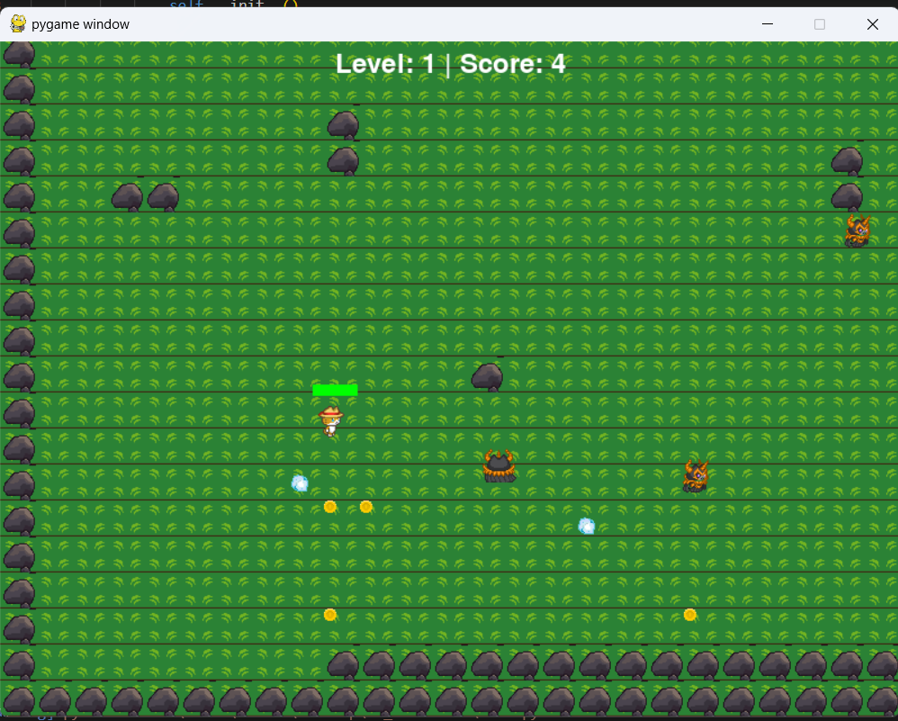

# **Project**

This is a 2D game developed by **Pygame** library in Python.

---

## **Key Features**

1. **Camera System**:
   - The camera follows the player and restricts movement to the level boundaries.

2. **Collectible Items**:
   - The player can collect coins to increase their score.
   - Completing a level requires collecting a specific number of coins.

3. **Sound Effects**:
   - Background music plays continuously during gameplay.
   - Sound effects are included for collecting coins and colliding with enemies.
   
---

## **Screenshots**

Here are some screenshots of key moments in the game:

### **Level 1**

- The player starts in Level 1, where they must collect coins, avoid enemies and enemie's bullets.

### **Level 2**

- In Level 2, the difficulty increases with more enemies and fewer coins.

### **Game Over**

- The "Game Over" screen is displayed when the player loses all their health.

### **Level Completed**

- The "Level Completed" screen is displayed when the player finishes a level.

---

## **Installation and Launch Instructions**

Follow these steps to run the game on your local machine:

### **Prerequisites**
- **Python 3.x**: Make sure Python is installed on your system.
- **Pygame**: Install the Pygame library using pip.

### **Steps**
1. **Clone the Repository**:
   ```bash
   git clone URL
   cd your-repo-name
   ```

2. **Install Dependencies**:
   Install the required Pygame library:
   ```bash
   pip install pygame
   ```

3. **Run the Game**:
   Execute the main Python script to start the game:
   ```bash
   python main.py
   ```

4. **Controls**:
   - Use the **arrow keys** to move the player.
   - Collect coins to increase your score.
   - Avoid enemies and their bullets to survive.
